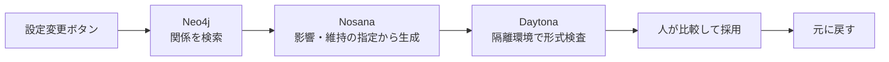

# 物語のドミノ

設定をひとつ変え、依存する場面を検索し、修正案を生成・検査してから採用／元に戻す日本語Webアプリです。デモ題材は **『消えたデモ ― 発表まであと2分』**。

Daytona・Neo4j・Nosanaが登場する架空のハッカソン喜劇です。実在企業の障害や発言を描いたものではありません。笑いは「誰かが担当していると思っていた」という参加者の思い込みに向けています。

## 現在の状態

- 専用フォルダ内に新規実装。既存ファイル・リポジトリ設定・データは変更していません。
- 本人申告：3サービスのアカウント作成・スポンサークレジット取得済み。
- **3サービスの実接続と、変更ボタン→検索→生成→形式検査→採用→元に戻すをブラウザーで確認済みです。** 実生成を採用しても場面1・2は完全一致し、取り消しで5場面・前提・オチを復元しました。2分の発表台本を用意しています。説明を含む2分通しのリハーサル時間は未計測です。
- サンプルは事前作成の例です。AI生成、Neo4j検索、Daytona実行の結果として表示しません。
- ローカル操作と失敗経路を検証済み。詳細は [検証記録](docs/verification.md)。

## 起動

Node.js 22以上。確認環境は Node.js 22.23.0 / npm 10.9.8 / macOS。

```sh
cd hack-sprint-tokyo
npm ci
# .env がない初回のみ：
cp -n .env.example .env
chmod 600 .env
npm start
```

[ローカルアプリ](http://127.0.0.1:3210)を開きます。ブラウザ画面はビルド不要のHTML/CSS/JavaScript、サーバーはNode.js標準HTTPです。別ポートは `.env` の `PORT` で指定できます。`npm run dev` はソース変更時に再起動します。`.env` の変更後は手動で停止・再起動してください。

## 接続設定の入力先

**キー・パスワードはチャットに貼らず、このフォルダの `.env` へ直接入力してください。** `.env` はGit除外、権限600。ブラウザへ配信するのは `public/` 内の明示した画面ファイルだけで、SDK例外・URL・キーをログ／APIに出しません。APIキーを含むURLをコードやスクリーンショットへ貼らないでください。

| サービス | 必要項目 | 接続成功の判断 |
|---|---|---|
| Neo4j | `NEO4J_URI`、`NEO4J_USERNAME`、`NEO4J_PASSWORD`。必要なら `NEO4J_DATABASE` | `verifyConnectivity()` と `RETURN 1` が成功 |
| Nosana（OpenAI互換） | 本人の稼働中モデルの完全な `NOSANA_CHAT_COMPLETIONS_URL`、実際の `NOSANA_MODEL`、必要な `NOSANA_API_KEY` | モデルの短文が正常終了して返る |
| Nosana（Ollama） | `NOSANA_API_STYLE=ollama`、本人の `/api/generate` の完全URLを `NOSANA_ENDPOINT`、実際の `NOSANA_MODEL`、必要な `NOSANA_API_KEY` | `done:true` の短文が返る |
| Daytona | `DAYTONA_API_KEY`、起動中の既存 `DAYTONA_SANDBOX_ID`。必要なら `DAYTONA_API_URL` / `DAYTONA_TARGET` | Sandbox内の `python3` が固定確認コードを実行し、終了0と期待する出力を返す |

Nosanaの管理用APIキーと、推論エンドポイントの認証キーは同じとは限りません。本人のエンドポイントが意図して認証不要の場合だけ `NOSANA_ALLOW_UNAUTHENTICATED=true` を指定します。外部接続はHTTPSが必要です。一般的なダッシュボードURL・推測したモデル名は使用できません。

まだ環境がない場合は [接続の準備](docs/setup.md) を参照してください。このアプリは新しい有料ジョブやSandboxを作成せず、既存Sandboxの起動・削除やクレジット購入も行いません。

Daytonaキーは [この端末専用の入力画面](http://127.0.0.1:3210/setup) からも保存できます。伏せ字入力で、保存後に入力欄を消去します。設定変更後のサーバー再起動が必要です。

設定後、画面の **「接続を確認」** を押します。CLI確認は次のコマンドです（CLIの結果はブラウザサーバーとは別プロセスなので、本実行前に画面でも確認してください）。

```sh
npm run check:connections
```

3サービスの確認は独立して実行します。1サービスの失敗で残りの確認を中断しません。成功を捏造した埋め合わせはありません。

## スポンサー製品の実装と実利用状況

Neo4jの実経路検索、Nosanaの短文応答と5場面の生成、Daytonaでの生成結果の実コード検査を同じ実行で確認しました。採用後の場面1・2維持と、元に戻す操作による全体の復元をサーバーと実ブラウザーの両方で検証済みです。

| 製品 | 実装した処理 | 使用SDK／方式 | 実接続 |
|---|---|---|---|
| Neo4j Database | Scene/Premise/Storyと依存関係を保存し、可変長の関係をたどって影響IDと経路を取得 | `neo4j-driver` 6.2.0、Cypher | 接続・場面3/4/5の実検索成功 |
| Nosana上の本人の推論エンドポイント | 元の全5場面・変更した前提・影響ID・維持IDを送り、JSONの修正案を生成 | Ollama HTTP API / `qwen3.5:9b` | 短文応答・JSONの修正案生成成功 |
| Daytona Sandbox | 固定Python検査を隔離環境で実行し、終了値とJSON結果をアプリへ返す | `@daytona/sdk` 0.211.2 | 生成結果の7項目合格・異常データの不合格を確認 |



接続情報はローカルサーバーだけが保持します。Nosanaへ渡すのは架空の物語と編集条件、Daytonaへ渡すのは固定の検査コードと検査用データです。

Neo4jは専用ラベル `StoryDominoStory` / `StoryDominoPremise` / `StoryDominoScene` と専用 `STORY_NAMESPACE` を使い、`ON CREATE` と `MERGE` でこの作品の新しいデータだけを作成します。既存データを削除・上書きしません。前提→場面3→場面4→場面5の `IMPACTS` を保存し、実際の `MATCH path ... [:IMPACTS*1..5]` 検索結果からカードを強調します。実装は [services.mjs](src/services.mjs)。Neo4jの永続データは原作と関係図で、採用の履歴は永続化しません。

Nosanaの結果をDaytonaへ渡す前に、元の場面1・2で上書きして取り繕う処理はありません。モデルの修正結果が維持対象を変えていれば、検査で不合格になります。JSON自体が壊れている場合は生成段階の失敗です。

Daytonaでは生成文をコードとして実行しません。固定Pythonコードに、物語と修正案を環境変数内のJSONデータとして渡します。IDの型・欠落・重複、必要な5場面、本文の存在、場面1・2のタイトルと本文の完全一致を検査します。**形式検査は文章の意味の判定ではありません。すべての矛盾を検出したとは主張しません。** 内容を人が読んで採用します。

## 操作

1. 「接続を確認」で3サービスの実応答を確認。
2. 「実はデモは完成していた」を押す。
3. Neo4jの影響場面→Nosanaの修正案→Daytonaの形式検査を順に表示。
4. 内容を確認して「この修正案を採用」。形式検査不合格では採用不可。
5. 「元に戻す」で5場面・前提・オチを元に戻す。

設定なしの確認は「サンプルを試す」。サンプルの採用／取り消しはブラウザ内だけで行い、実APIへの採用リクエストとは分離しています。

## 確認済み機能・テスト

`npm test` はNode.jsのテストランナーを使います。Python検査コードのローカル実行テストには `python3` が必要です。テストのprovider doubleは自動テスト内だけにあり、本番のAPIルートには実サービス以外の成功処理を組み込んでいません。

場面の欠落・重複・型不正・維持対象改変、検査前採用の拒否、生成／検査失敗、runの独立性、取り消しによる復元、秘密を含むSDK例外の非表示を検証します。実サービス通信の確認には `.env` が必要です。

## 未実装・制約

- 実サービスを使うブラウザー操作は確認済み。変更ボタンを押して16秒後に確認した時点で生成・形式検査が完了していました。これは確認時点の上限で、正確な処理時間の計測値ではありません。説明を含む2分通しの発表リハーサルは未計測。
- ユーザー認証・公開環境・任意の作品編集・意味の自動判定・履歴の永続化は未実装。
- 現在は指定の5場面、固定の前提変更1つに対応。影響結果は場面3・4・5の集合を要求し、不一致なら失敗を表示。
- サーバーは127.0.0.1のみで待受け。外部公開用の認証・運用構成はまだありません。
- 修正候補と採用状態は実行ごとのメモリ上のみ（最長1時間、最大100件）。再起動・再読込で原作に戻り、元の物語は消えません。
- モデルの短文応答とJSON生成は実機確認済み。初回のモデル準備中には45秒のタイムアウトが発生し、準備完了後の再試行で成功しました。発表前に短文応答を確認してください。生成タイムアウト45秒、応答100KB上限。Ollamaではthink:false・temperature:0を指定し、全文生成のformatには場面・理由・オチのJSON Schemaを渡します。
- 形式検査合格でも、生成文の意味や笑いの自然さは保証しません。変更した前提との整合性を人が読んで判断します。
- Daytona接続キーの有効期限は2026年9月13日。Sandboxは15分の無操作で自動停止します。次回デモ前に管理画面で再開が必要な場合があります。
- Neo4jは今回専用の14日間無料トライアルDB。Nosanaは1台・Simple・最大実行時間2時間、自動延長なしの承認済み設定。GPU待機を含め作成から2時間後に停止するという意味ではありません。
- Sandbox内にPython 3が必要。既存Sandboxの自動停止・料金体系は本人の設定によります。
- 公開GitHubリポジトリ、提出フォーム送信、購入・削除は未実行。実行直前に本人確認が必要です。

## 主催者条件・提出準備

[主催者の当日案内](https://community.theaibuilders.dev/c/20260912_daytona_tokyo#message_2151160767)を2026年9月12日に読み取り確認。締切16:00、ライブデモ16:20、各チーム2分。東京開催の案内ですが、時刻のタイムゾーン文字は投稿にありません。全3スポンサーが必須かは明示されていないため確定しません。

本人提供のイベント案内から、チーム上限6名、審査は完成度・革新性・現実の問題解決・スポンサー製品の活用と確認しました。

[提出フォーム](https://tinyurl.com/0912submit)の必須項目：提出者メール、作品名、チームメンバー名／メール、**公開GitHubリポジトリURL、PDFスライド（10MB以内）**。

- [2分の実演台本](docs/demo-script.md)
- [提出情報の下書き](docs/submission-draft.md)
- [PDFスライドの提出前ドラフト](output/pdf/story-domino-submission-draft.pdf)

PDFは3サービスのブラウザー通し操作成功を反映した提出前ドラフトです。公開・提出は未実行です。

## 公式資料

- [Neo4j JavaScript接続](https://neo4j.com/docs/javascript-manual/current/connect/)／[Cypher可変長パス](https://neo4j.com/docs/cypher-manual/current/patterns/variable-length-paths/)
- [Nosana Endpoints](https://learn.nosana.com/inference/endpoints)／[Nosana vLLM](https://learn.nosana.com/inference/examples/vllm.html)
- [Daytona TypeScript SDK](https://www.daytona.io/docs/en/typescript-sdk/)／[Process](https://www.daytona.io/docs/en/typescript-sdk/process/)
